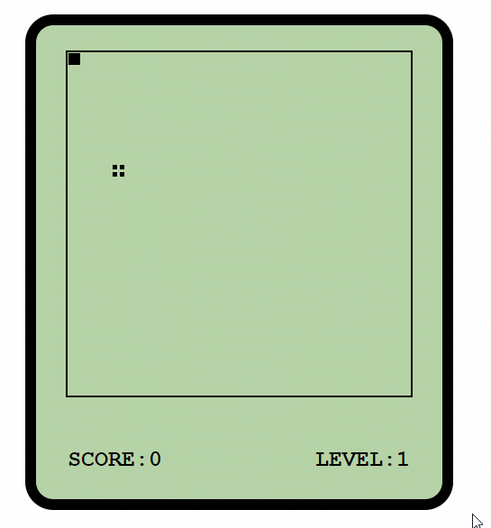

## 前言

* 使用typescript的语法完成的
* 使用了webpack打包工具,可以兼容IE10以上浏览器
* 该有的碰撞到自己身体和碰到墙壁游戏结束和食物随机功能都有~,具体可以自己体验体验
* [@在线演示](https://eat-snake.netlify.app/)

## 下载

* [github地址](https://github.com/superBiuBiuMan/snake_eatFood)
* [gitee地址](https://gitee.com/superBiuBiu/snake_eatFood)

## 制作难点

### **蛇掉头的功能**

```js
/* 设置坐标 */
    XYPositionSet(newValue: number, axle: string) {
        //新的坐标等于原来的坐标,不设置
        //@ts-ignore
        if (newValue === this[axle]) {
            return;
        }
        //判断是否超过范围
        if (this.isOutArea(newValue)) {
            throw new Error("碰到墙壁了");
        }

        //设置是哪一个坐标上的位置
        let setPosition = axle === "X" ? "left" : "top";

        /**
         *  1.判断掉头二种方法,一种是根据方向,如果当前为左边的方法,那么下一次方向为右边,那么就是掉头了,上下的判断也是
         *  2.第二种方法: 左右判断,如果此时蛇头的left等于第一个蛇身的left,那么就是掉头了
         *               上下判断,如果此时蛇头的top等于第一个蛇身的top,那么就是掉头了
         */
        let one = this.bodies[1] as HTMLElement;
        let checkPosition = axle === "X" ? "offsetLeft" : "offsetTop";
        //注意顺序! 
        //如果此时蛇头的left/top等于新设置的蛇头的值,那么就是掉头了,并且此时已经在向新方向在移动了!!!!!!!!!!
        //@ts-ignore
        if (one && one[checkPosition] === newValue) {
            //说明掉头了
            // console.log("掉头了");
            //掉头后,方向都变化了,比如left => right , top => down
            // 蛇 向左走是left在减少 向右走是left在增加
            // 蛇 向上走是top在减少  向下走是top在增加
            // 并且,执行到这一段代码的时候,方向已经被改变了,并且已经确定了新位置

            //对于水平突然变化
            // 如果新值newValue大于旧值X,则说明蛇之前在向左走, 现在方向被修改为了向右,所以现在每次蛇都是向右在移动位置(每次都+10的left),要使蛇继续向左走就需要值每次减少而不是增加(设置每次都-10的left)
            // 如果新值newValue小于旧值X,则说明蛇之前在向右走, 现在方向被修改为了向左,所以现在每次蛇都是向左在移动位置(每次都-10的left),要使蛇继续向右走就需要值每次增加而不是减少(设置每次都+10的left)

            //对于垂直突然变化
            // 如果新值newValue大于旧值Y,则说明蛇之前向上走,现在方向被修改了向下,所以现在每次蛇都是向下在移动位置(每次都+10的top),要使蛇继续向下走就需要值每次减少而不是增加(设置每次都-10的top)
            // 如果新值newValue小于旧值Y,则说明蛇之前向下走,现在方向被修改了向上,所以现在每次蛇都是向上在移动位置(每次都-10的top),要使蛇继续向下走就需要值每次增加而不是减少(设置每次都+10的top)

            //@ts-ignore
            if (newValue > this[axle]) {
                //@ts-ignore
                newValue = this[axle] - 10;
            } else {
                //@ts-ignore
                newValue = this[axle] + 10;
            }
        }
        //设置body位置
        this.setBodyiesPosition();
        //设置头的位置
        //@ts-ignore
        this.head.style[setPosition] = newValue + "px";
        //判断是否碰撞到了自己
        this.checkBump();
    }
```


## 效果截图

* 图片


* 动态图

